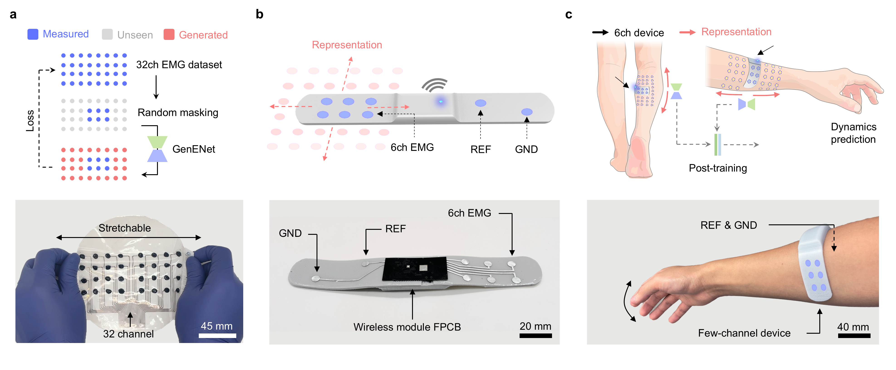

<div align="center">

<!-- LOGO -->


<br/>

```
 █████╗ ████████╗ ██████╗ ███╗   ██╗███╗   ██╗
██╔══██╗╚══██╔══╝██╔════╝ ████╗  ██║████╗  ██║
███████║   ██║   ██║  ███╗██╔██╗ ██║██╔██╗ ██║
██╔══██║   ██║   ██║   ██║██║╚██╗██║██║╚██╗██║
██║  ██║   ██║   ╚██████╔╝██║ ╚████║██║ ╚████║
╚═╝  ╚═╝   ╚═╝    ╚═════╝ ╚═╝  ╚═══╝╚═╝  ╚═══╝
```

# Adaptive Temporal Graph Neural Networks
### for Robust ECG-Based Authentication in Resource-Constrained Wearable Sensors

<br/>

[]()
[]()
[]()
[]()

<br/>

> **⚠️ This repository is currently under active construction.**  
> Code, documentation, and pretrained models are being progressively released.  
> Star ⭐ the repo to stay updated.

<br/>

---

</div>

## 📋 Overview

**ATGNN** is a novel framework for ECG-based biometric authentication, designed to operate efficiently on resource-constrained wearable IoT devices. It addresses two core challenges in real-world deployment: **physiological robustness** and **computational efficiency**.

<div align="center">

| Metric | Performance |
|:---:|:---:|
| 🎯 Authentication Accuracy | **98.7%** avg across datasets |
| 📉 Equal Error Rate (EER) | **1.2%** |
| ⚡ Computational Reduction | **75%** via hierarchical pruning |
| 🕐 Inference Latency (wearable) | **282 ms** (within 500 ms threshold) |
| 📅 Long-term Stability | **< 1.8%** degradation over 6 months |

</div>

---

## ✨ Key Innovations

### 🔷 1. Input-Adaptive Temporal Graph Representation
Each authentication window is converted into a dynamic graph where heartbeat segments serve as nodes. Edges encode both **temporal proximity** and **morphological similarity**, with graph topology reconstructed per input — enabling robust authentication under varying physiological states.

### 🔷 2. Dual-Level Attention Mechanism
- **Node-level attention** — weights individual heartbeats by signal quality and morphological consistency  
- **Feature-level attention** — dynamically adjusts feature channel contributions based on physiological context

### 🔷 3. Hierarchical Pruning Strategy
A gradient-based pruning algorithm progressively removes redundant graph edges and feature channels during training, achieving up to **75% reduction** in computational complexity while preserving authentication accuracy.

---

## 🏗️ Architecture

```
Raw ECG Input
      │
      ▼
┌─────────────────────────┐
│  Multi-Scale Wavelet    │  ← Time-frequency features (J=6 scales)
│  Scattering Transform   │
└──────────┬──────────────┘
           │
      ▼
┌─────────────────────────┐
│  Dynamic Temporal       │  ← Heartbeat nodes + weighted edges
│  Graph Construction     │
└──────────┬──────────────┘
           │
      ▼
┌─────────────────────────┐
│  Adaptive Temporal GNN  │  ← GraphSAGE + dual-level attention
│  (4 GCN layers)         │     + temporal skip connections
└──────────┬──────────────┘
           │
      ▼
┌─────────────────────────┐
│  Hierarchical Pruning   │  ← Edge + feature channel pruning
└──────────┬──────────────┘
           │
      ▼
┌─────────────────────────┐
│  Siamese Verification   │  ← Metric learning + identity decision
│  Network                │
└─────────────────────────┘
```

---

## 📁 Repository Structure

```
ATGNN/
├── networks/               # Graph neural network architectures
├── preprocessing/          # ECG signal preprocessing pipeline
├── pretraining/            # Pretraining scripts and configs
├── utils/                  # Helper functions and utilities
├── MAE_loss.py             # Masked autoencoder loss implementation
├── mask_transform.py       # Signal masking for self-supervised learning
├── train_monitor.py        # Training visualization and monitoring
├── download_model.py       # Pretrained model downloader
├── requirements.txt        # Python dependencies
└── assets.png              # Project assets
```

---

## 🚀 Getting Started

> **🚧 Full setup instructions are coming soon.**

### Prerequisites

```bash
Python >= 3.8
PyTorch >= 2.0
CUDA >= 11.7 (optional, for GPU acceleration)
```

### Installation

```bash
# Clone the repository
git clone https://github.com/AmbitYuki/ATGNN.git
cd ATGNN

# Install dependencies
pip install -r requirements.txt
```

### Download Pretrained Models

```bash
python download_model.py
```

---

## 📊 Datasets

The framework is evaluated on four ECG databases:

| Dataset | Subjects | Duration | Sampling Rate | Conditions |
|---------|----------|----------|---------------|------------|
| MIT-BIH (MITDB) | 47 | 30 min | 360 Hz | Arrhythmia |
| PTB Diagnostic (PTBDB) | 290 | 2 min | 1000 Hz | Diagnostic |
| ECG-ID | 90 | 20 sec | 500 Hz | Normal |
| LTDB *(ours)* | 115 | 10 min | 250 Hz | Various |

---

## 🗺️ Roadmap

- [x] Repository initialized
- [x] Core network modules uploaded
- [x] Preprocessing pipeline
- [x] Training monitor
- [ ] 📖 Full training documentation
- [ ] 🤗 Pretrained model release
- [ ] 📓 Jupyter notebook tutorials
- [ ] 🐳 Docker support
- [ ] 📄 Paper link (upon acceptance)


---

<div align="center">

**⚠️ This project is under active development. Watch for updates! ⭐**

<br/>

*Built with ❤️ for secure, efficient wearable authentication*

</div>
